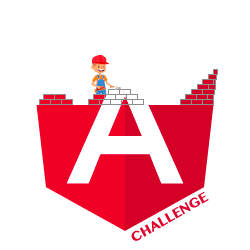

  

Collection of Angular challenges

 

## Intro

This project has been created with three purposes:

- The first purpose is to assist you in becoming better at Angular and its ecosystem. 💪
- The second purpose is to share best practices and different implementations of the same problem to gain diverse perspectives. 📖
- The last one is to lower the barrier to open source contribution.

**Sharing knowledge can benefit everyone.**

Furthermore, if you are struggling with a concept, please open an issue. I will attempt to create a challenge based on that idea.

If you would like to propose a challenge, this project is open source, so feel free to share your ideas. They are more than welcome.

> **Learning by reading is good but learning by doing is better.**

## Challenges

Check [all 56 challenges](https://angular-challenges.vercel.app/)

## Solution ✨
- 1. Projection
  - 1.1 Solution with input
  - 1.2 Solution with content child
  - 1.3 Solution with let- context type infer
